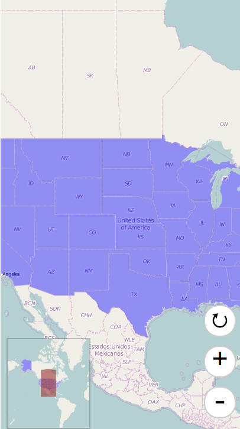
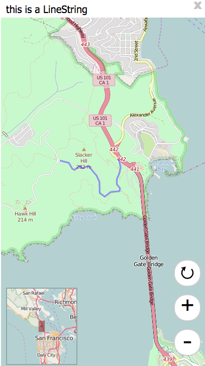
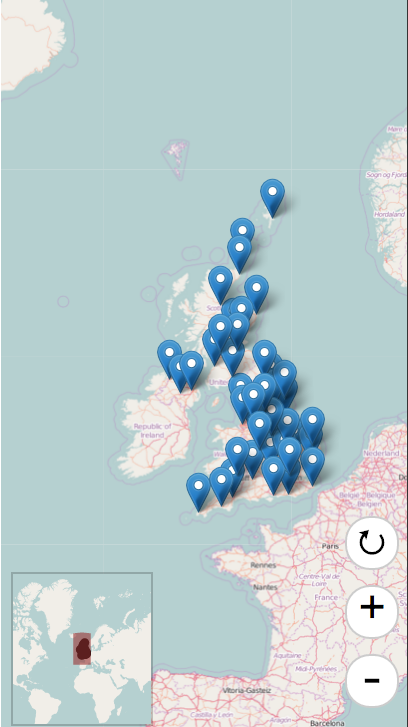

# react-d3-map-mobile

Mobile first map!

## Install

```
npm install react-d3-map-mobile
```

## Example

### Polygon



```js
"use strict";

var React = require('react');
var ReactDOM = require('react-dom');
var topojson = require('topojson');

var MercatorMobileMap = require('../../lib/index').MercatorMobileMap;
var PolygonGroup = require('../../lib/index').PolygonGroup;

var css= require('./css/polygon.css');

// Example
(function() {
  var width = window.innerWidth > 736? 736 : window.innerWidth;
  var height = window.innerHeight > 736? 736 : window.innerHeight;
  var scale = (1 << 12);
  var controllerScale = (1 << 8);
  var center = [-100.95, 40.7];
  var data = require('json!../data/states.json');
  var content = function(d) { return 'hello I am polygon'; }

  ReactDOM.render(
    <MercatorMobileMap
      width= {width}
      height= {height}
      scale= {scale}
      controllerScale= {controllerScale}
      center= {center}
    >
      <PolygonGroup
        data= {data}
        overlayContent= {content}
      />
    </MercatorMobileMap>
  , document.getElementById('blank-multipolygon')
  )

})()

```

### Line



```js
"use strict";

var React = require('react');
var ReactDOM = require('react-dom');
var topojson = require('topojson');

var MercatorMobileMap = require('../../lib/index').MercatorMobileMap;
var LineGroup = require('../../lib/index').LineGroup;

var css= require('./css/polygon.css');

// Example
(function() {
  var width = window.innerWidth > 736? 736 : window.innerWidth;
  var height = window.innerHeight > 736? 736 : window.innerHeight;
  var scale = (1 << 22);
  var controllerScale = (1 << 17);
  var center = [-122.486052, 37.830348];
  var data = {
      "type": "Feature",
      "properties": {
        "text": "this is a LineString"
      },
      "geometry": {
          "type": "LineString",
          "coordinates": [
              [-122.48369693756104, 37.83381888486939],
              [-122.48348236083984, 37.83317489144141],
              [-122.48339653015138, 37.83270036637107],
              [-122.48356819152832, 37.832056363179625],
              [-122.48404026031496, 37.83114119107971],
              [-122.48404026031496, 37.83049717427869],
              [-122.48348236083984, 37.829920943955045],
              [-122.48356819152832, 37.82954808664175],
              [-122.48507022857666, 37.82944639795659],
              [-122.48610019683838, 37.82880236636284],
              [-122.48695850372314, 37.82931081282506],
              [-122.48700141906738, 37.83080223556934],
              [-122.48751640319824, 37.83168351665737],
              [-122.48803138732912, 37.832158048267786],
              [-122.48888969421387, 37.83297152392784],
              [-122.48987674713133, 37.83263257682617],
              [-122.49043464660643, 37.832937629287755],
              [-122.49125003814696, 37.832429207817725],
              [-122.49163627624512, 37.832564787218985],
              [-122.49223709106445, 37.83337825839438],
              [-122.49378204345702, 37.83368330777276]
          ]
      }
  }
  var content = function(d) { return d.properties.text; }

  ReactDOM.render(
    <MercatorMobileMap
      width= {width}
      height= {height}
      scale= {scale}
      controllerScale= {controllerScale}
      center= {center}
    >
      <LineGroup
        data= {data}
        overlayContent= {content}
      />
    </MercatorMobileMap>
  , document.getElementById('blank-line')
  )

})()

```

### Point



```js
"use strict";

var React = require('react');
var ReactDOM = require('react-dom');
var topojson = require('topojson');

var MercatorMobileMap = require('../../lib/index').MercatorMobileMap;
var PointGroup = require('../../lib/index').PointGroup;
var MarkerGroup = require('../../lib/index').MarkerGroup;

var css= require('./css/polygon.css');

// Example
(function() {
  var width = window.innerWidth > 736? 736 : window.innerWidth;
  var height = window.innerHeight > 736? 736 : window.innerHeight;
  var scale = 1200 * 5;
  var controllerScale = (1 << 8);
  var center = [-5, 55.4];
  var uk = require('json!../data/uk.json');
  var data = topojson.feature(uk, uk.objects.places);
  var content = function(d) { return d.properties.name; }

  ReactDOM.render(
    <MercatorMobileMap
      width= {width}
      height= {height}
      scale= {scale}
      controllerScale= {controllerScale}
      center= {center}
    >
      <MarkerGroup
        data= {data}
        overlayContent= {content}
      />
    </MercatorMobileMap>
  , document.getElementById('blank-point')
  )

})()

```

## License

Apache 2.0
